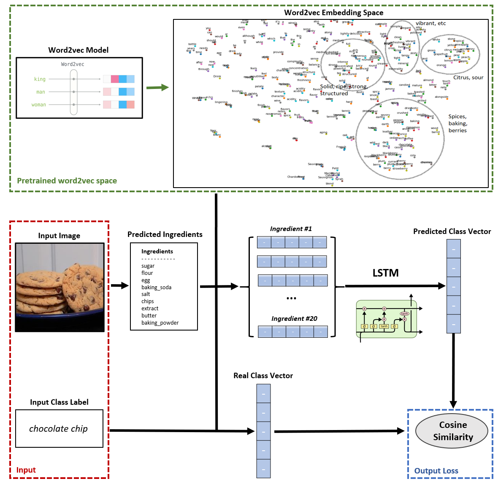

# Food Classification Methods
 This repository contains the source code for my Thesis in the Department of Electrical and Computer Engineering at Aristotle University of Thessaloniki. The scope of this project is the employment of Computer Vision and Natural Language Processing techniques to deal with the complex problem of Food Categorization. Specifically, this project evaluates mainly two different classification techniques: the classification using the visual features of an image and the classification with the intermediate step of predicting a list of ingredients.

---

This thesis studies the feasibility of using an ingredient prediction system, in order to categorize food images. This problem is known in the literature with the term multiclass classification and requires the prediction of the correct class given an input image. Specifically, this work compares three different methodologies, the first step of which is to find abstract vector representations of images.

The first methodology uses for this representation the penultimate layer of ResNet-50. The parameters of ResNet-50 are initialized with the pre-trained weights in ImageNet. Next, a fully connected level with output neurons equal to the number of classes is applied, which acts as a direct classifier.

The second methodology uses a recent model for the prediction of ingredients and recipes given a food image, which employs transformers and the mechanism of attention. This model is fed with the vector representations of the images at its input. The predicted ingredients are then imported into a classifier, which attempts to predict the correct class. At the same time, a simpler classification method is implemented, based on probability theory.

The third and most essential methodology combines a series of techniques belonging to different areas of machine learning, in order to achieve the desired result. Like the first two, it calculates the vector representations and predicted ingredients of an image. However subsequently, it maps the words of the ingredients and the class to a vector space of a trained word2vec model of a wide vocabulary. Obviously, not all components and classes belong to the model vocabulary, so some entries are ignored. The vector sequences of the ingredients are processed by a series of LSTM layers to produce a vector of the above vector space. Finally, a process of finding the nearest neighbors is implemented to classify each sample.

The networks are trained in various datasets and training statistics, as well as the results of the testing are presented in tables to facilitate the comparison of methodologies.

---

    

